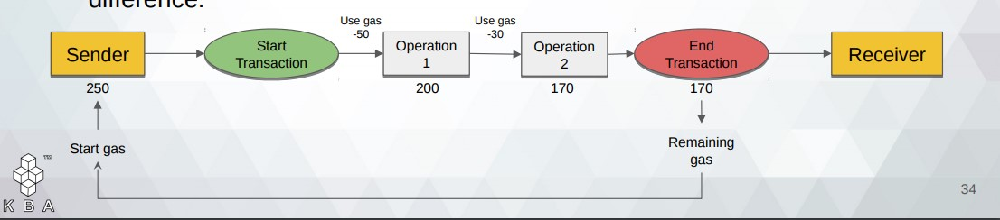
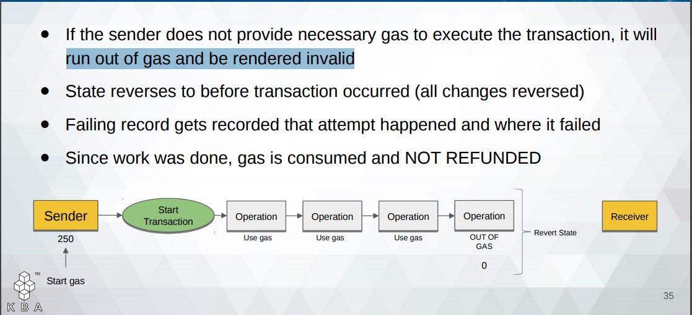
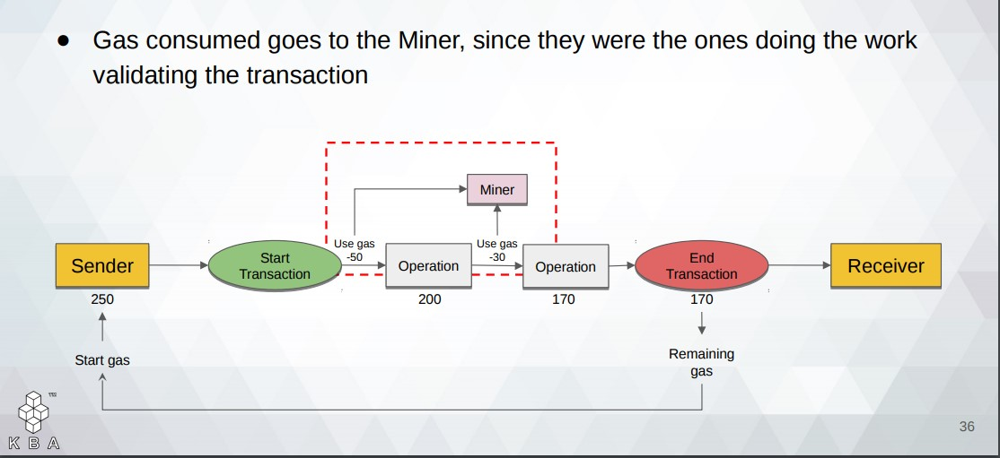
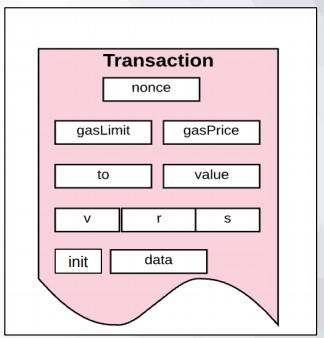

02 - Transactions

- Gas cost is constant for low-level operations in EVM(OPCode &rarr; MUL, ADD).
- Gas price changes dynamically according to market demand
- This price is paid to the miner
        &rarrhk; Fee = Gas Cost(Gas Used) x Gas Price(Current market price[According to Ether value])   
- Start Gas &rarr; Gas alloted for the transaction(Maximum Amount for a single transaction)
- Transaction Fee &le; Start Gas
   
  ## ``Design challenges of being a dApp developer``
   
- Miners can change the Block Gas Limit by a minute amount.

<u>Successful Transaction</u>:

&rarr; When Gas Fee is calculated, user must have enough ETH in acoount to cover the maximum. When the actual transaction happens, user is refunded the difference.

<u>Unsuccessful Transaction</u>:

 

- ## <u>Transaction Block</u>

&#8208; v,r,s &rarr; values for the transaction's signature
&#8208; init &rarr; Initialization Data - Constructor
***
 

- ## <u>Contract to Contract Messages</u>
    
    - Communicate via “internal transactions”
    - Internal transactions do not contain a gas limit
     
***    

## Normal Transaction

 ## <u> 1)Transaction Execution - Validity</u>

    - Valid transaction Signature
    - Valid transaction Nonce
    - Gas Limit &ge; Intrinsic Gas Used
    - Intrinsic Gas = Predefined Gas Fee + Storage Fee + Contract Creation
 

 ## <u> 2) Transaction Execution - Process</u>
    1. Upfront execution cost deducted from account
    2. Nonce increases by 1
    3. Remaining Gas Calculated
    4. Execution: Transactional Computations
    5. State Finalized (pending no invalid)
    6. Unused gas refunded to sender + refund balance
    7. Gas consumed given out to miner
    8. Gas used added to block gas counter
    9. All accounts in self destruct are deleted
    10. Final State Reached and logs created for transaction
***
## Contract Creation
## <u> Transaction Execution - Process</u>

    ● New Contract Address Generated
    ● Set nonce to zero
    ● Ether value added to this new account balance, deducted from sender’s
    balance
    ● Set storage as empty
    ● Set contract’s codeHash as the hash of an empty string
    ● Account initialized; init code command used to create contract account
    ● Constructor executed
    ● Codehash is set
    ● If successful, a final contract creation cost is paid
    ● Unspent Gas refunded; achieve final state
 

