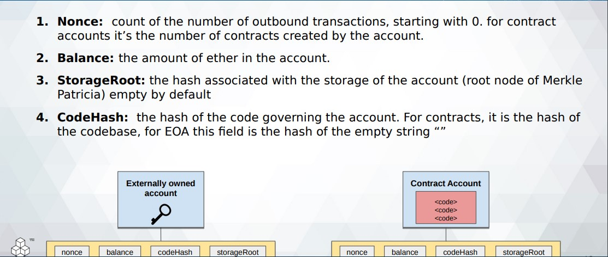

01 - State of Blockchain

## Bitcoin State &rarr; Unspent Transactions

<u>Unspent Transactions</u>
&rarr; Sum of all transactions with one or more inputs but no output

&rarr; Coins are transferred to some account, but no money is spent

## Ethereum State 

&rarr; Basic unit of state in ethereum is an Account

&rarr; The big difference with ethereum is that its nodes store the most recent state of each smart contract, in addition to all of the ether transactions

&rarr; Each user’s balance, all the smart contract code and where it’s all stored

## Ethereum Accounts

&rarr; EVM can be thought of as a large decentralized computer containing millions of objects, called "accounts", which have the ability to maintain an internal database, execute code and talk to each other.
 
&rarr; There are two types of accounts:

<u>Externally owned account (EOAs)</u>: an account controlled by a private key, and if you own the private key associated with the EOA you have the ability to send ether and messages from it.

<u>Contract</u>: an account that has its own code, and is controlled by code.
 
&rarr; **By default, the Ethereum execution environment is lifeless; nothing happens and the state of every account remains the same. However, any user can trigger an action by sending a transaction from an externally owned account, setting Ethereum's wheels in motion. If the destination of the transaction is another EOA, then the transaction may transfer some ether but otherwise does nothing. However, if the destination is a contract, then the contract in turn activates, and automatically runs its code.**

 

